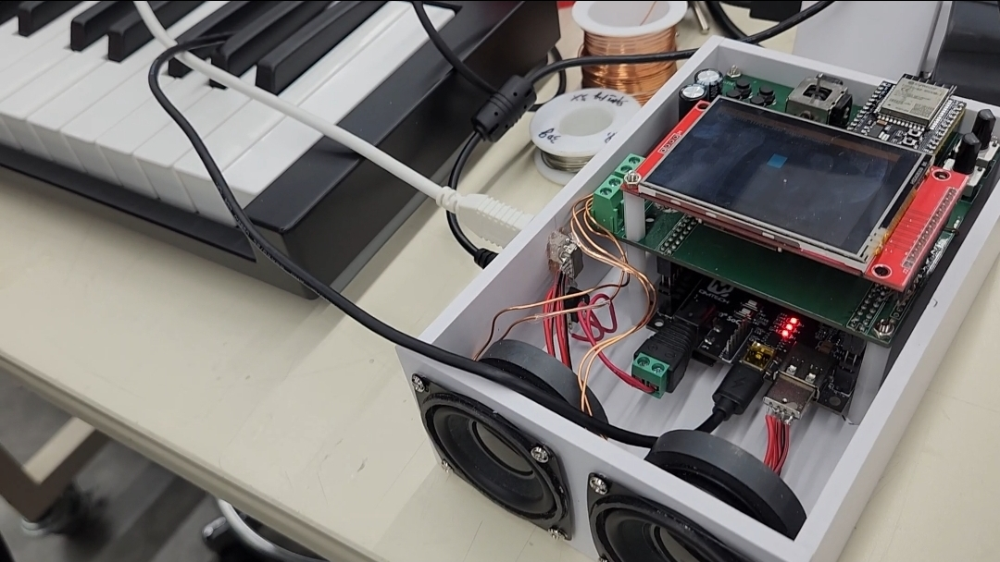
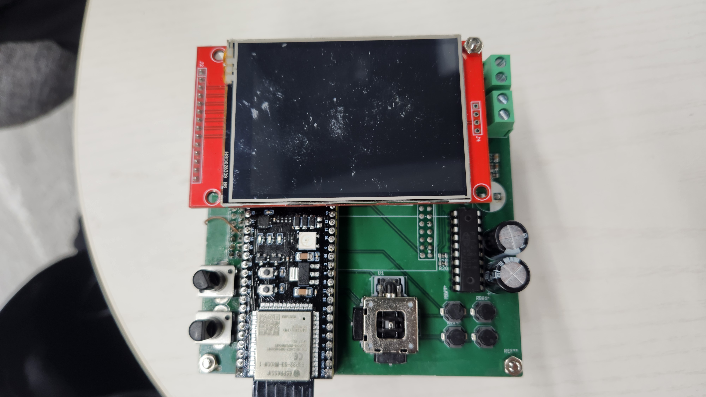
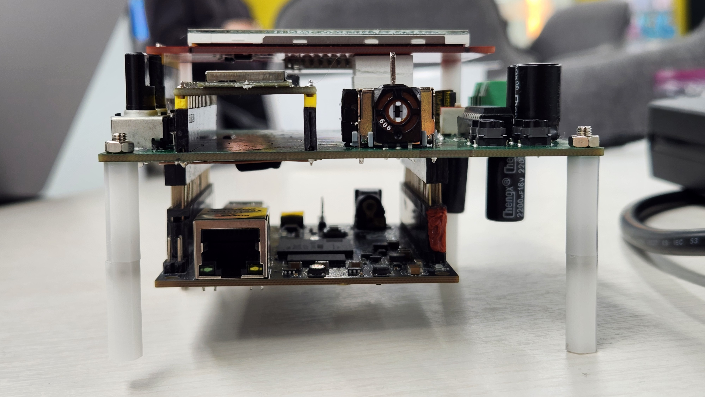
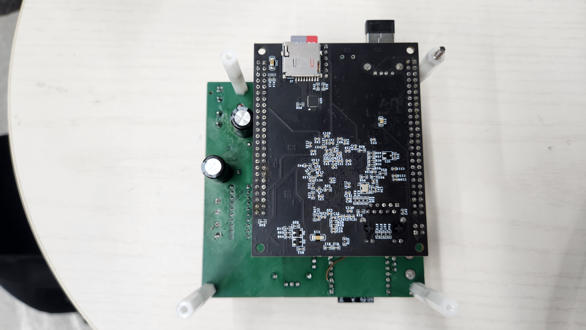
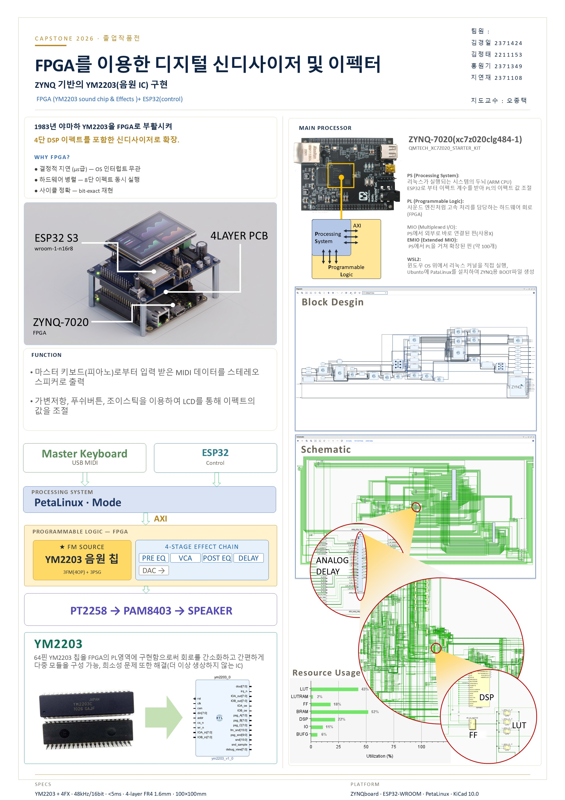

# 🎹 FPGA를 이용한 디지털 신디사이저 및 이펙터

**ZYNQ 기반 YM2203(음원 IC) 구현** — Zynq-7020 SoC 위에서 1983년 야마하 FM 음원 칩 YM2203을 재현하고, 실시간 DSP 이펙트 체인을 더한 신디사이저입니다.

> Capstone 2026 졸업작품 · 김경일, 김정태, 홍원기, 지연재 · 지도교수 오종택

<p align="center">
  
</p>

## 개요

- USB MIDI 마스터 키보드로 연주한 음을 FPGA 속 YM2203이 합성하고, 이펙트 체인을 거쳐 스테레오 스피커로 출력합니다.
- 가변저항, 푸시버튼, 조이스틱으로 LCD를 보면서 이펙트 값을 실시간으로 조절할 수 있습니다.
- 더 이상 생산되지 않는 64핀 YM2203을 PL 영역에 구현해서 회로를 단순화하고 부품 수급 문제를 해결했습니다.

**왜 FPGA인가?**
- **결정적 지연(µs 단위)**: OS 인터럽트의 영향을 받지 않음
- **하드웨어 병렬**: 여러 이펙트를 동시에 실행
- **사이클 정확**: 원본 칩과 bit-exact 재현

## 시스템 구성

```
 USB MIDI 키보드 ──┐        ┌── ESP32-S3 (UI·제어)
                   ▼        ▼
 ┌───────── PS: PetaLinux (UIO 드라이버, 모드 FSM) ─────────┐
 │                          │ AXI                           │
 │ PL:  YM2203 (3FM 4-op + 3PSG)                            │
 │        └→ PRE EQ → VCA → POST EQ → DELAY → DAC           │
 └──────────────────────────┼───────────────────────────────┘
                            ▼
              PT2258(볼륨) → PAM8403(앰프) → 스피커
```

| 구분 | 역할 |
|---|---|
| **PS** (ARM Cortex-A9) | PetaLinux 실행. ESP32로부터 이펙트 계수를 받아 AXI로 PL 레지스터 설정, MIDI 처리 |
| **PL** (FPGA) | YM2203 음원 코어, 이펙트 체인, 델타-시그마 DAC 등 고속 신호 처리 |
| **ESP32-S3** (WROOM-1-N16R8) | 사용자 입력 처리 및 제어, SPI로 PS와 통신 |

### Linux 동작 모드 (`src/linux/midi.c`)

| 모드 | 기능 |
|---|---|
| MENU | 모드 선택 |
| SYNTH / MIDI | 신디사이저 연주 |
| VGM PLAYER | VGM 파일 재생 |
| USB MIDI KEYBOARD | USB MIDI 키보드 + YM2203 연주 |
| INST SETUP | 악기(보이스)·화성 설정, 프리셋 관리 |

## 하드웨어

<p align="center">
  
  
  
</p>

| 항목 | 내용 |
|---|---|
| 메인 보드 | QMTECH XC7Z020 Starter Kit (`xc7z020clg484-1`) |
| 제어 MCU | ESP32-S3 WROOM-1-N16R8 |
| 디스플레이 | ILI9341 SPI TFT LCD |
| 오디오 출력 | FPGA 델타-시그마 DAC → PT2258(I²C 볼륨) → PAM8403 → 스피커 |
| 확장 PCB | 4-layer FR4 1.6 mm, 100 × 100 mm (KiCad) |
| 사양 | 48 kHz / 16-bit, 지연 < 5 ms |

핀 배치는 [`src/constraints/spi_zynq.xdc`](src/constraints/spi_zynq.xdc)에 있습니다.

## 직접 설계한 PL 모듈

YM2203/YM2149 음원 코어는 오픈소스 JT12·JT49를 기반으로 했고(아래 [출처](#출처-및-라이선스) 참고), 그 외 이펙터와 시스템 모듈은 직접 설계했습니다. DSP48 사용량을 줄이기 위해 시분할(TDM) 구조를 적극적으로 사용했습니다.

| 분류 | 모듈 |
|---|---|
| EQ · 다이내믹스 | `pre_eq_4band`(4밴드, 단일 biquad TDM 엔진으로 DSP 75% 절감), `post_eq_6band_ms`, `eq_6band_top`, `iir_df1`, `vca_top`(컴프레서), `character_svf`, `warm_engine`(새추레이션) |
| 딜레이 · 모듈레이션 | `analog_delay_top`(아날로그 스타일 스테레오 딜레이), `chorus_top`, `unified_fx_top`, `flanger_top`, `phaser_stereo`, `user_st`(오토 패너), `shimmer_pitch`, `LFO`(8채널 NCO) |
| 리버브 · 공간 모델 | `fdn_reverb_top`(FDN 리버브), `space_model_core`, `geometry_engine`, `reflection_engine`, `cluster_engine`, `space_er_engine`, `space_behavior_engine`, `schroeder_ap`, `allpass_diffuser` 등 |
| 분석 | `fft_system_top`, `fft_fifo`, `fft_mux` |
| 시스템 · 인터페이스 | `ym2203_writer`(AXI GPIO → FIFO → YM2203 레지스터 쓰기 FSM), `timeslot_master`, `timeslot_bridge`, `audio_engine_mux`, `audio_to_axis`, `input_frontend`, `dac_bridge`, `gate_env`, `sig_gen`, `i2c_iobuf` |

LUT용 `.hex` 파일은 [`src/gen_luts.py`](src/gen_luts.py)로 생성합니다.

## 폴더 구조

```
.
├── src/
│   ├── hdl/            # Verilog 소스 (음원 코어 + 이펙터 + 시스템)
│   ├── constraints/    # XDC 핀 제약
│   ├── linux/          # PetaLinux UIO 드라이버 및 프리셋 헤더
│   ├── gen_luts.py     # LUT 생성 스크립트
│   └── *.hex           # LUT 데이터
├── scripts/
│   └── project_1.tcl   # Vivado 프로젝트 스크립트
├── doc/                # 사진, 작품 패널
├── CREDITS.md          # JT12/JT49 기반 파일 목록
└── LICENSE             # GPL-3.0
```

## 개발 환경

- Vivado / Vitis 2024.2
- PetaLinux (WSL2 Ubuntu에서 빌드)
- KiCad 10.0

## 작품 패널

<p align="center">
  
</p>

## 출처 및 라이선스

YM2203 FM 음원과 YM2149 PSG 부분은 Jose Tejada Gomez(jotego)의 **[JT12](https://github.com/jotego/jt12)**, **[JT49](https://github.com/jotego/jt49)** 코어를 기반으로 수정한 것입니다. 해당 파일 목록과 원본 파일 대응표는 [CREDITS.md](CREDITS.md)에 있고, 각 파일 상단에도 원본 저작권 고지를 표기했습니다.

JT12/JT49가 GPL-3.0이므로 이 저장소 전체도 **[GNU General Public License v3.0](LICENSE)** 을 따릅니다.
